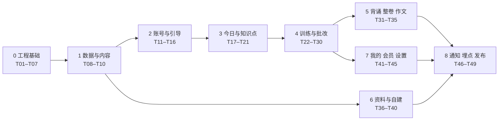

# 刷题精灵 施工文档 v1

Sep 24, 2026 · @Z

## 1. 使用说明

全部开发拆成 49 张任务卡，每次只把一张卡交给 Claude Code，验收通过再进下一张。三份依据文档：[PRD v1](https://claude.ai/code/artifact/d439ce8b-4f2b-467a-960a-baf81cda282b)、[技术规格 v1](https://claude.ai/code/artifact/25054969-e5a5-4022-8ea7-f0a9b6a2f8f1)、[视觉稿 v2](https://claude.ai/artifact/URoTFxjLpB4NnenFA3VARC)。

### 1.1 开工前准备

1. 按附录创建仓库根目录的 `CLAUDE.md`
2. 把 PRD、技术规格和本施工文档导出为 Markdown，分别存为仓库 `docs/prd.md`、`docs/tech-spec.md`、`docs/construction.md`
3. 视觉稿源码放在 `docs/design/`：`INDEX.md` 为页面编号 → 文件索引，`NOTES.md` 为各页交互说明，每页一个 `.dc.html`（390×844）
4. 文档审阅中发现的矛盾与缺失记录在 `docs/open-questions.md`，团队结论先改进三份文档，再交给 Claude Code 实现

### 1.2 交给 Claude Code 的提示词模板

```markdown
执行任务卡 T26「主观题批改」。
1. 先读 CLAUDE.md，再读卡片「参考」中列出的文档章节和 docs/design 中对应页面
2. 先输出实现计划（改哪些文件、新增哪些表或函数、怎么测试），等我确认
3. 按计划实现，只改本卡范围内的代码
4. 补齐单元测试，跑通 pnpm typecheck、pnpm test
5. 逐条对照卡片「验收」自检，输出自检结果和我需要手动验证的步骤
```

### 1.3 任务卡格式

每张卡包含：**依赖**（必须先完成的卡）、**参考**（PRD / 技术规格章节与页面编号）、**交付**（要写出来的东西）、**验收**（怎么判断做完了）。一张卡一个分支（命名 `card/T01-<英文短名>`）、一个合并请求；CI（GitHub Actions）通过且验收通过才合并。

### 1.4 验收分工

| 谁 | 验什么 |
| --- | --- |
| Claude Code | 类型检查、单元测试、按验收条目自检 |
| 技术同学 | 代码合并、迁移执行、在 dev build 上用真机跑通主流程 |
| 产品同学 | 对照 docs/design 视觉稿与 PRD 验页面、交互与异常状态 |
| 运营同学 | 涉及内容与 AI 质量的卡（T10、T26、T34、T37 等）看评测结果与真实样例 |

## 2. 阶段总览

9 个阶段，阶段 0–1 是地基必须先做完；之后阶段 2–4 是主干，阶段 6 可以和阶段 4 并行，阶段 5、7 在主干之后。



| 阶段 | 任务卡 | 完成标志 | 可并行 |
| --- | --- | --- | --- |
| 0 工程基础 | T01–T07 | 空壳 App 能在真机跑起来；函数、Worker、AI 层各有一个示例通过测试 | T02 / T06 / T07 互不依赖 |
| 1 数据与内容 | T08–T10 | staging 中有海大完整知识框架包，RLS 测试通过 | — |
| 2 账号与引导 | T11–T16 | 新用户可登录并走完预设路径引导、看到诊断报告 | T12、T13 可与 T14 并行 |
| 3 今日与知识点 | T17–T21 | 首页有今日计划；知识点可浏览、搜索、自评 | T19–T21 与 T17–T18 并行 |
| 4 训练与批改 | T22–T30 | 今日训练全流程可走通，主观题批改达到评测门槛 | T24 / T25 / T30 并行 |
| 5 背诵 整卷 作文 | T31–T35 | 三个专项功能可用，作文批改达到评测门槛 | 三条线互相独立 |
| 6 资料与自建 | T36–T40 | 上传资料可建库；未收录院校用户可走完自建路径 | 与阶段 4 并行 |
| 7 我的 会员 设置 | T41–T45 | 看板、兑换码开通会员、注销等可用 | T43 可推迟到正式版 |
| 8 通知 埋点 发布 | T46–T49 | 种子用户拿到安装包 | — |

功能开关：T04 建立 `feature_flags` 表，阶段 5、6 的功能默认关闭，内测时按用户分批打开，与 PRD 3 的分批开放策略一致。

## 3. 阶段 0：工程基础

#### T01 仓库与工程骨架

- 依赖：无
- 参考：技术规格 1、8（目录结构）
- 交付：pnpm 单仓库；`apps/mobile`（Expo Router + TS，四个空 Tab）；`apps/worker`；`packages/shared`、`rules`、`ai`、`ui-tokens`；统一 tsconfig、ESLint、Prettier；Node 22 LTS（`.nvmrc` + `engines`）；工作区包名前缀 `@peetraining/`；GitHub Actions CI 跑 typecheck、lint、test；App 名称「考研Training」、iOS Bundle ID `peetraining.dreamerlab.cn`（均暂定）；EAS 配置 dev / preview / production 三个 profile
- 验收：`pnpm install && pnpm typecheck && pnpm test` 通过；dev build 装到 iOS 与安卓真机能打开并切换四个 Tab

#### T02 设计令牌与基础组件

- 依赖：T01
- 参考：技术规格 8.3；视觉稿「00 设计规范」
- 交付：`packages/ui-tokens`（颜色、字号、间距、圆角、字体加载）；基础组件全套（Button、Chip、Card、ListRow、StatNumber、MasteryBar、Segmented、Switch、OptionItem、OtpInput、AnswerEditor、SheetModal、Dialog、Toast、Skeleton、AiProgress、EmptyState、ErrorState、TabBar、TopBar、StepBar）；开发用组件画廊页 `/dev/gallery`
- 验收：画廊页与规范板逐项对照一致；组件内无裸色值（lint 规则检查）；所有可点区域 ≥ 44 × 44

#### T03 Supabase 环境与存储

- 依赖：T01
- 参考：技术规格 10、11
- 交付：dev / staging / prod 三个项目；迁移工具链；所有表默认开启 RLS 的基线迁移；私有存储桶 `materials`、`answers`、`essays`、`avatars` 及按 user\_id 前缀的访问策略；环境变量模板 `.env.example`
- 验收：本地 `supabase db reset` 可从零重建；用两个测试用户验证互相无法读取对方存储文件

#### T04 业务函数框架

- 依赖：T03
- 参考：技术规格 4.1
- 交付：Edge Functions 公共中间件（JWT 校验、统一响应与错误码、zod 入参校验、幂等键、按用户与 IP 限流、request\_id 日志）；`feature_flags` 表与读取工具；示例函数 `ping`；函数本地测试脚手架
- 验收：`ping` 在未登录时返回 UNAUTHORIZED；同一幂等键重复请求只执行一次；限流触发返回 RATE\_LIMITED

#### T05 任务服务框架

- 依赖：T03
- 参考：技术规格 5.1
- 交付：`apps/worker`：pgmq 两个队列（q\_interactive、q\_batch）、按任务类型注册处理器、超时与重试、失败记录、并发上限配置、健康检查接口、优雅退出；示例任务 `echo`
- 验收：入队 100 个 `echo` 全部完成；人为抛错的任务按配置重试后标记失败；两个队列的并发互不影响

#### T06 AI 接口层骨架

- 依赖：T01、T03
- 参考：技术规格 6.1、6.2；PRD 8.3
- 交付：`packages/ai`：能力注册机制（prompt.md、schema.ts、config.ts、examples/）、`ai.run()`、提示词版本号、zod 输出校验与带错重试、模型档位映射、`ai_calls` 日志表迁移；一个真实模型适配器 + 一个 mock 适配器；`evals/` 目录与 `pnpm eval <能力>` 脚本骨架；示例能力 `explain_kp`
- 验收：mock 下单测覆盖校验失败重试、超时、日志写入；真实模型下 `explain_kp` 返回合法 JSON；`pnpm eval explain_kp` 能输出报告

#### T07 规则引擎

- 依赖：T01
- 参考：PRD 7；技术规格 7.1–7.4
- 交付：`packages/rules`：applyEvent、deriveState、schedule、decay、isMisjudged（以为会了）、buildPlan、题目用时估算；`rule_params` 默认值
- 验收：PRD 7.1–7.4 中每一行表格都有对应单元测试；覆盖率 ≥ 90%；纯函数无 IO

## 4. 阶段 1：数据模型与内容导入

#### T08 数据模型迁移

- 依赖：T03
- 参考：技术规格 3.1–3.5（含四张系统表）、4.2
- 交付：全部表、枚举、外键、索引的迁移；视图 `v_user_tree`、`v_user_kp`（合并预设、kp\_overrides 与私有内容）、`v_mastery_summary`；RPC `search_all`（全文检索 + 前缀）；`packages/shared` 中与表对应的 TS 类型（由数据库生成）
- 验收：从零迁移成功；为一个测试用户造数据后，两个视图返回的合并结果符合「预设 + 覆盖 + 私有」规则；search\_all 在 1 万条知识点下 < 200ms

#### T09 行级权限策略

- 依赖：T08
- 参考：技术规格 10.1
- 交付：按 10.1 表格为每张表写 RLS 策略；自动化 RLS 测试（两个普通用户 + 匿名 + service role 四种身份，逐表验证读写）
- 验收：测试全部通过；受控表（user\_kp\_state、usage\_counters、memberships 等）客户端写入一律被拒

#### T10 知识框架包与院校目录导入

- 依赖：T08
- 参考：技术规格 11.3；PRD 13.1
- 交付：知识框架包导入格式说明（`supabase/seed/pack-format.md`：科目、板块、章节、知识点、原文、采分点、出处、真题、试卷、作文题、素材的 JSON 结构）；导入与校验脚本（重复、缺字段、孤立节点检查）；全国院校专业目录导入脚本；用运营提供的海大内容导入 staging
- 验收：海大包导入无报错；抽查 20 个知识点在 staging 与原始资料一致；脚本可重复执行（幂等）；运营同学签字确认内容

## 5. 阶段 2：账号与预设路径引导

#### T11 手机号登录与路由守卫

- 依赖：T02、T04、T09
- 参考：PRD 模块 0；技术规格 4.3（auth-sms-\*）、8.1、9；页面 0.2b、0.3、0.3b
- 交付：auth-sms-send / auth-sms-verify（限频、5 次错误失效、5 分钟过期）；自定义会话签发；手机号登录、验证码页及错误态；会话持久化与刷新；启动路由守卫（未登录 / 引导中 / 已完成）
- 验收：新号码验证后自动建号并进入 1.1；老用户直接进首页；PRD 模块 0 中 0.2b、0.3 的每条限制规则都可复现

#### T12 一键登录、微信与 Apple 登录

- 依赖：T11
- 参考：PRD 模块 0；技术规格 9；页面 0.2
- 交付：一键登录 SDK 接入 + auth-onetap；微信登录 + auth-wechat；Apple 登录 + auth-apple；未绑手机号时的绑定流程；协议勾选校验与高亮提示
- 验收：三种方式都能登录；一键登录失败自动切到手机号登录；未勾选协议时无法登录并出现提示

#### T13 启动页、协议、权限说明与版本检查

- 依赖：T11
- 参考：页面 0.1、0.4、0.5、0.6；技术规格 11.2
- 交付：启动页与分流；协议页（两个 Tab，内容来自后台配置）；通用权限说明组件（相机、麦克风、通知、相册四套文案，拒绝后引导去设置）；`app_versions` 检查与普通 / 强制更新弹窗
- 验收：首次拍照时先出说明再出系统弹窗；拒绝后再次使用出现「去设置」；强制更新弹窗无法关闭

#### T14 预设路径引导

- 依赖：T10、T11
- 参考：PRD 模块 1（1.1–1.3）、5.1；页面 1.1、1.2、1.3
- 交付：选择院校（已收录置顶，未收录项先显示但点击提示「即将开放」，T39 再接通）；选择专业与科目展示；备考设置（阶段默认值按月份推断）；onboarding-save；中途退出后恢复到当前步骤
- 验收：走完三步后 study\_settings 与 user\_subjects 数据正确；杀掉 App 重进回到中断步骤

#### T15 摸底测与诊断报告

- 依赖：T07、T14
- 参考：PRD 模块 1（1.4–1.8）、7.1；技术规格 4.3（diag-\*）；页面 1.4–1.8
- 交付：diag-start（按板块从预设题库抽 20 题）；答题页（含「不确定」、上一题、退出确认与进度保存）；diag-submit 计算板块分；write\_report 能力生成标题与计划文案；报告生成中与报告页；首页「未完成摸底」状态所需数据
- 验收：20 题覆盖 5 个板块各 4 题；已答不足 5 题退出不生成报告；报告中低于 40% 的板块标记短板；AI 文案失败时显示规则生成的默认文案

#### T16 学习提醒

- 依赖：T13、T14
- 参考：页面 1.9；PRD 模块 1
- 交付：提醒时间与三个开关写入 study\_settings；通知权限流程；设备与推送令牌写入 devices（推送发送在 T46）
- 验收：开启后 devices 有记录；拒绝系统权限仍能进入首页，设置页显示未开启状态

## 6. 阶段 3：今日与知识点

#### T17 今日计划生成

- 依赖：T05、T07、T15
- 参考：PRD 7.4；技术规格 5.3、7.4
- 交付：gen\_daily\_plans 定时任务（北京时间 00:05，分批入队）；plan-today（缺失时即时生成）；mastery\_decay 定时任务；daily\_plans 完成度更新接口
- 验收：冲刺期与基础期各造一个用户，计划组成比例、题目用时合计与每日时长的偏差 ≤ 10%；同一知识点当日不重复；定时任务重复执行不会生成两份计划

#### T18 今日首页与完成页

- 依赖：T17
- 参考：PRD 模块 2；页面 2.1、2.1b、2.1c、2.2（2.1d、2.1e 在 T40 接入）
- 交付：首页状态判定与三种状态 UI；倒计时；「以为会了」卡片；快捷入口；掌握度条；今日训练完成页（周历、连续天数、掌握度变化前 3）；下拉刷新
- 验收：用数据构造出三种状态，页面与视觉稿一致；「以为会了」为 0 时隐藏；跨天后计划与倒计时刷新

#### T19 知识点树与搜索

- 依赖：T09、T10
- 参考：PRD 模块 3（3.1、3.2）；页面 3.1、3.2
- 交付：科目切换；板块折叠与记忆；四种筛选；掌握状态与真题次数标签；搜索页（历史、结果三分组、高亮、空状态）
- 验收：海大包 600+ 知识点下树首屏渲染 < 1 秒；筛选结果与数据库一致；搜索「意境」三组结果都出现

#### T20 知识点卡片与原文

- 依赖：T06、T19
- 参考：PRD 模块 3（3.3、3.5）；技术规格 6.3（explain\_kp）；页面 3.3、3.5
- 交付：卡片全部区块；self-rate 函数（接 packages/rules）；AI 解读首次生成并缓存；真题标签跳转；左右滑动切换；原文查看（预设显示书名页码，资料原页定位高亮在 T36 后接通）
- 验收：自评「掌握」出现提示且 M 最高 50；有作答记录后自评不改 M；AI 解读二次打开不再调用模型

#### T21 知识点编辑与报错

- 依赖：T20
- 参考：PRD 模块 3（3.3b、3.4）；页面 3.3b、3.4
- 交付：更多操作弹层；kp-edit（编辑、合并、拆分、调整归属，预设写 kp\_overrides，私有直接改）；「已自定义」标记与恢复预设；content-report；未保存离开确认
- 验收：编辑预设知识点不影响另一个用户；恢复预设后覆盖记录删除；合并后采分点去重、两边的作答与掌握记录合并到目标知识点

## 7. 阶段 4：训练、批改与错题本

#### T22 练习会话与答题容器

- 依赖：T17
- 参考：PRD 模块 4（4.1、4.2、4.21）；技术规格 4.3（session-start）、8.2；页面 4.1、4.2、4.21
- 交付：训练首页；练习设置（范围、题型、题量、开关，设置记忆）；session-start（daily / custom / wrong）；答题容器（进度条、计时、左右切换、退出确认、断点续做）；MMKV 草稿机制；离线预取与补交队列
- 验收：答到第 5 题杀掉 App，重进可从第 6 题继续且草稿恢复；飞行模式下客观题可作答，联网后自动补交且不重复

#### T23 客观题与掌握度更新

- 依赖：T22
- 参考：PRD 7.1–7.3、7.5；页面 4.3
- 交付：客观题页（即时判分、解析、知识点入口、看答案）；answer-submit 客观分支：写 attempts、更新 user\_kp\_state、错题收录与移出、今日计划完成度；answer-reveal
- 验收：答对 / 答错 / 看答案三种情况下，M、状态、下次复习日与 PRD 表格一致；同一题两个不同日期连续答对后从错题本移出

#### T24 主观题作答与语音输入

- 依赖：T22
- 参考：页面 4.4；技术规格 9（语音）
- 交付：主观题页；AnswerEditor（字数与建议区间）；语音录入转文字；剩余批改次数显示；「看参考答案」自评模式
- 验收：语音 30 秒可转成文字并可编辑；每 5 秒草稿写入；看参考答案不消耗额度

#### T25 拍照作答

- 依赖：T05、T24
- 参考：页面 4.5；技术规格 5.1（ocr\_answer）、9
- 交付：拍照 / 相册、多张续拍；upload-sign 上传；ocr\_answer 任务与 ocr\_postcheck；识别确认页（低置信度标出、可编辑、重拍）
- 验收：用 10 张真实手写答题纸测试，识别结果可用且不确定字词被标出；模糊照片提示重拍

#### T26 主观题 AI 批改

- 依赖：T06、T23、T24
- 参考：PRD 8.1–8.3；技术规格 2.1、6.2、6.3（grade\_subjective）；页面 4.6、4.7
- 交付：grade\_subjective 能力（提示词、schema、少样本）；服务端二次校验（分值上限、总分、evidence 为原文子串）；Worker 任务：写 gradings、掌握度、错题本、失败回滚额度；批改中页（Realtime + 轮询回退、超时文案）；批改结果页
- 验收：`pnpm eval grading` 达到 PRD 8.3 门槛（偏差 ≤ 1 分比例 ≥ 80%），同一答案连跑 3 次分差 ≤ 1；P95 ≤ 8 秒；运营抽查 20 条真实作答认可

#### T27 额度与额度用尽

- 依赖：T23、T26
- 参考：PRD 9.1；技术规格 7.5；页面 4.9
- 交付：usage\_counters 原子扣减 SQL 函数；会员判断；quota-status；额度弹层三条出路；「待批改」存储与次日提醒（推送在 T46 接通）；失败与复核不计次
- 验收：并发 10 个批改请求时额度不超扣；第 4 次批改弹出额度层；会员不受限但用量有记录

#### T28 批改异议与复核

- 依赖：T26
- 参考：页面 4.8；技术规格 5.1（grade\_recheck）
- 交付：异议弹层；grading-dispute；grade\_recheck（更严格提示词）；结果页「已复核」标记；复核仍有异议进入人工队列（disputes.status = manual）
- 验收：复核不扣额度；复核结果作为新 grading 保存并关联原记录

#### T29 本组总结与错题本

- 依赖：T23、T26
- 参考：PRD 7.5；页面 4.10、4.11
- 交付：本组总结（按题型得分率、失分知识点、跳转规则）；错题本（四种分组、重做、左滑移出、重做全部）；空状态
- 验收：主观题未满分、看答案的题都进入错题本；重做全部按下次复习日升序

#### T30 AI 出题

- 依赖：T06、T17
- 参考：PRD 8.1；技术规格 6.3（gen\_question）、5.1（gen\_questions）
- 交付：gen\_question 能力（客观题、名词解释、简答）；gen\_questions 任务：补齐今日计划缺题、预生成高频知识点题目；题目质量标记与报错下线；按「能力 + 知识点 + 题型」缓存复用
- 验收：`pnpm eval questions` 人工审核可用率 ≥ 90%；预设知识点的题目在用户间复用；被报错 3 次的题自动下线

## 8. 阶段 5：背诵、真题整卷与作文

三条线互相独立，可以并行交给不同的 Claude Code 会话。

#### T31 背诵三模式

- 依赖：T23
- 参考：PRD 模块 4（4.17–4.20）、7.1、7.3；技术规格 6.3（compare\_recite）；页面 4.17–4.20
- 交付：背诵会话（今日计划中的背诵任务、从卡片单独发起）；挖空（位置 = 采分关键词）；默写（打字 / 拍照，关键词比对）；口述（录音、转写、要点覆盖）；compare\_recite（规则优先 + AI 同义补充）；recite-rate；背诵完成页与复习安排
- 验收：挖空位置与采分点关键词一致；默写结果只按关键词判定；三档自评对应的下次复习日符合 PRD 7.3；比对不消耗额度

#### T32 真题整卷模拟

- 依赖：T26、T27
- 参考：PRD 模块 4（4.12–4.16）、5.4；技术规格 5.1（grade\_paper）；页面 4.12–4.16
- 交付：真题列表与状态；paper-start / paper-save / paper-submit；整卷答题页（180 分钟倒计时、剩 15 分钟提醒、到时自动交卷、标记、离开暂停与严格模式设置）；答题卡；交卷确认；grade\_paper（客观即时、主观逐题入队、汇总）；整卷报告；整卷批改额度
- 验收：倒计时在 App 后台与重启后准确；交卷后客观分立即可见、主观批改完成后报告自动刷新；同一时间只能有一套进行中

#### T33 作文写作与提交

- 依赖：T22、T25
- 参考：PRD 模块 5（5.1、5.2、5.2b）；页面 5.1、5.2、5.2b
- 交付：作文题目列表（真题 / AI 命题 / 自拟）与本周目标；写作页（限时开关、字数、草稿）；拍照上传手写稿（多页排序、单页重拍、识别确认）；essay-submit；作文额度
- 验收：1000 字作文草稿在切后台、杀进程后完整恢复；多页照片顺序正确拼接

#### T34 作文 AI 批改

- 依赖：T06、T33
- 参考：PRD 8.1、8.3；技术规格 6.3（grade\_essay）；页面 5.2c、5.4
- 交付：grade\_essay 能力（五维度评分标准、总评、逐段批注）；Worker 任务与失败回滚；批改中页（可离开）；批改结果三视图；作文异议复用 T28；写作方法掌握度更新
- 验收：`pnpm eval essay` 达到门槛（总分偏差 ≤ 10 分比例 ≥ 75%），同一作文连跑 3 次总分差 ≤ 6；P95 ≤ 40 秒；运营抽查 5 篇认可

#### T35 作文本、范文、素材与作文知识库

- 依赖：T34
- 参考：PRD 模块 3（3.6）、模块 5（5.3、5.5、5.6）；页面 3.6、5.3、5.5、5.6
- 交付：作文本（多稿标记、分数趋势、最弱维度跳转）；范文详情（结构导航与批注）；素材库弹层（按主题、收藏、插入提示）；908 作文知识库页
- 验收：同题第二稿显示「第 2 稿」并可与第一稿对比分数；素材插入为灰色提示且可删除

## 9. 阶段 6：资料上传与自建知识库

这一阶段 AI 质量风险最高，每张卡都要用真实资料验证。可在阶段 1 完成后与阶段 4 并行。

#### T36 资料上传与解析

- 依赖：T05、T09
- 参考：PRD 模块 6（6.3）、5.5；技术规格 5.1–5.2（parse\_material）、10.2；页面 6.3
- 交付：upload-sign（格式、大小、页数、额度校验）；material-create；parse\_material（有文字层直接抽取，否则逐页渲染走 OCR，逐页落库、失败页单独重试）；我的资料页（进度、状态、删除确认、已用额度）；原文查看接通资料原页定位与高亮（补全 T20）
- 验收：100 页文字版 PDF 解析 ≤ 10 分钟；扫描版 PDF 可识别；加密 PDF 给出明确错误；删除资料时仅由它产生的知识点一并删除

#### T37 知识点提取与挂载

- 依赖：T36、T06
- 参考：技术规格 5.2（阈值、去重）、6.3（extract\_kps）；页面 6.4
- 交付：extract\_kps 能力；按置信度自动挂载 / 生成待确认；知识点去重合并出处；资料解析详情页（待确认三种处理、一键全部确认、已挂载列表）；candidate-resolve
- 验收：`pnpm eval knowledge` 原文一致率 ≥ 90%、采分点召回 ≥ 85%；用运营准备的一份海大笔记上传，挂载位置抽查 30 条正确率 ≥ 85%

#### T38 真题识别与考频

- 依赖：T36
- 参考：技术规格 6.3（detect\_questions）
- 交付：detect\_questions 能力；题目入库并关联知识点；按年份组卷（用户上传的整套真题）；更新 exam\_freq
- 验收：上传一份含 3 年真题的资料，题目、题型、分值识别正确率 ≥ 90%；知识点「考过 N 次」随之更新

#### T39 自建路径引导

- 依赖：T14、T36、T37
- 参考：PRD 模块 1（1.2b–1.3c）、5.1；页面 1.1、1.2b、1.2c、1.3b、1.3c
- 交付：1.1 接通未收录院校分支；选择专业（全国目录 + 手动填写）；custom-subjects-create（科目类型、招生目录拍照识别）；按科目上传资料页（三类资料、首次建库赠送 200 页）；build\_jobs 与知识库生成中页（进度订阅 + 同页备考设置）；「先进入 App」
- 验收：未收录院校用户从登录走到生成中页；关闭 App 后生成继续，完成后收到消息；首次建库 200 页额度独立计算

#### T40 框架确认与自建摸底

- 依赖：T39、T15
- 参考：PRD 模块 1（1.3d、1.4b）、模块 2（2.1d、2.1e）；技术规格 6.3（build\_framework）、5.1（gen\_diag）；页面 1.3d、1.4b、2.1d、2.1e
- 交付：build\_framework 能力（有目录按目录、无法归类进未分类）；框架确认页（重命名、合并、删除、重新生成且保留手动修改）；gen\_diag（每板块 2–3 题共 10 题）与答题页「报错」；首页「知识库生成中」「未上传资料」两种状态
- 验收：用 3 份不同质量的真实资料（整理好的笔记、杂乱讲义、只有真题）分别建库，产品同学判定框架可用；报错题不计分；首页五种状态全部可构造出来

## 10. 阶段 7：我的、会员、设置

#### T41 我的与掌握度看板

- 依赖：T23、T27
- 参考：PRD 模块 6（6.1、6.2）、7.2；页面 6.1、6.2
- 交付：我的页（个人信息、会员条、看板卡片、免费额度、菜单）；看板页（总体分布、板块与周变化、写作类五维、偏差列表与一键加入今日训练）
- 验收：看板数字与数据库一致；「加入今日训练」后今日计划新增对应题目且不重复

#### T42 会员中心与兑换码

- 依赖：T27
- 参考：PRD 9；技术规格 3.5；页面 6.5、6.6、6.7
- 交付：会员中心（权益对比、三档选择）；redeem（错误锁定、时长叠加）；支付结果页；兑换码批量生成脚本（档位、时长、有效期、批次）
- 验收：兑换后立即解除额度限制；已是会员再兑换时长正确叠加；同一码第二次使用失败；错误 5 次后锁定 10 分钟

#### T43 应用内购买与安卓支付（正式版前）

- 依赖：T42
- 参考：技术规格 9
- 交付：iOS 非续期内购与 iap-verify、恢复购买；安卓微信 / 支付宝下单与回调；订单表与对账脚本
- 验收：沙盒环境完成购买、校验、开通、恢复购买；回调重复送达不重复开通

#### T44 邀请研友

- 依赖：T15、T42
- 参考：PRD 9.3；页面 6.8
- 交付：邀请码生成；分享与海报；注册引导中填写或链接带入；invite-bind；完成摸底后双方发放 7 天会员；累计上限 70 天；邀请记录
- 验收：好友只注册未完成摸底时不发奖励；第 11 个有效邀请不再发放

#### T45 备考设置、设置、账号安全、注销与反馈

- 依赖：T13、T16
- 参考：PRD 模块 6（6.9–6.13）；技术规格 5.3（cleanup）；页面 6.9–6.13
- 交付：备考设置（更换院校专业走引导流程、次日生效、重新摸底并对比）；设置页（通知开关与系统权限提示、清除缓存、关于、退出登录）；账号与安全（换绑手机、第三方解绑限制、设备管理）；注销（勾选 + 短信验证、7 天冷静期、撤销、cleanup 删除数据）；意见反馈（附带上下文 ID）
- 验收：注销冷静期内登录可撤销；期满后该用户所有表与存储文件被删除（保留匿名计费记录）；只剩一种登录方式时无法解绑

## 11. 阶段 8：通知、埋点、监控与内测发布

#### T46 消息中心与推送

- 依赖：T16、T26
- 参考：PRD 模块 2（2.3）；技术规格 5.1（push\_send）、5.3（remind\_push、pending\_grades）、9；页面 2.3
- 交付：消息中心（三类、跳转、已读、30 天保留）；push\_send；APNs 与安卓推送聚合接入；每日训练提醒、复习到期、资料解析完成、作文与整卷批改完成、待批改额度恢复五类推送
- 验收：五类推送在 iOS 与至少两个主流安卓品牌真机上收到，点击跳到正确页面；关闭某类开关后不再收到

#### T47 埋点

- 依赖：T11
- 参考：PRD 11.2
- 交付：events 表与客户端 / 服务端上报工具（批量、失败重试、公共字段自动附带）；PRD 11.2 全部事件接入；一个每日指标 SQL 视图（激活、留存、训练完成率、批改认可率、知识点修改率）
- 验收：走一遍新用户全流程后，每个关键事件都有记录且字段完整；指标视图可按预设 / 自建路径拆分

#### T48 监控、日志与成本看板

- 依赖：T05、T06
- 参考：技术规格 12
- 交付：崩溃上报；函数与 Worker 结构化日志（统一 request\_id、不落原文）；技术规格 12.1 的告警规则；AI 成本与批改质量简易看板（按日 token、单次成本、失败率、异议率）
- 验收：人为制造批改失败、队列积压、成本超限三种情况，均能在 5 分钟内收到告警

#### T49 内测发布

- 依赖：以上全部（T43 除外）
- 参考：技术规格 11；本文第 12 节
- 交付：staging 全量验收（按第 12 节清单）；prod 迁移与部署；安卓 APK 与 iOS TestFlight 构建；首批兑换码；种子用户安装说明（含安卓安装未知来源设置、TestFlight 邀请步骤）；功能开关按批次配置
- 验收：5 名团队成员在各自手机上用 prod 环境从安装走到完成一次今日训练；首批 20 名种子用户拿到安装包与兑换码

## 12. 全局验收清单

内测发布（T49）前在 staging 逐项勾选，全部通过才能部署 prod。

### 12.1 主流程

- [ ] 预设路径：新用户登录 → 引导 → 摸底 → 报告 → 提醒 → 首页 → 完成一次今日训练
- [ ] 自建路径：未收录院校用户登录 → 填科目 → 上传资料 → 生成并确认框架 → 摸底 → 首页 → 完成一组练习
- [ ] 主观题：打字、语音、拍照三种方式各提交一次并看到批改结果
- [ ] 额度：免费用户第 4 次批改弹出额度层；兑换会员后解除
- [ ] 整卷：完成一套真题并看到报告
- [ ] 作文：打字与拍照各提交一篇并看到批改
- [ ] 背诵：挖空、默写、口述各完成一条

### 12.2 状态与异常

- [ ] 首页五种状态均可构造并与视觉稿一致
- [ ] 每个列表页都有空状态；每个 AI 等待页都有超时文案与失败重试
- [ ] 断网作答后恢复网络，答案补交且不重复
- [ ] 答题、写作文中途杀进程，重进后草稿恢复
- [ ] 所有危险操作（退出训练、交卷、删除资料、退出登录、注销）都有确认

### 12.3 数据与安全

- [ ] RLS 自动化测试全绿；两个测试账号互相看不到资料、作答、作文
- [ ] 客户端代码与安装包中搜不到任何模型、短信、支付密钥
- [ ] 注销流程在测试账号上完整跑通，数据被清除

### 12.4 AI 质量

- [ ] 知识点、主观题批改、作文批改、出题四个评测全部达到 PRD 8.3 门槛
- [ ] 运营抽查：20 条主观题批改、5 篇作文批改、30 条挂载位置、1 份自建框架

### 12.5 设备与体验

- [ ] iOS 与至少 3 个主流安卓品牌真机（含一台中端机）跑通主流程
- [ ] 冷启动 ≤ 2 秒；系统字体放大 1.3 倍不破版
- [ ] 推送五类在真机收到

## 附录：CLAUDE.md

仓库根目录 `CLAUDE.md` 的当前版本如下（以仓库文件为准）。Claude Code 每次启动都会读取它；项目约定有变化时同步更新这份文件与本附录。

```markdown
# 刷题精灵 · 项目上下文

考研专业课 AI 刷题 App。帮考生把专业课资料变成可练、可测、可追踪的知识体系。
首期试点：海南大学 · 中国语言文学（预设路径）；其他院校专业上传资料生成专属知识库（自建路径）。

## 应用标识
- App 名称（暂定）：考研Training
- iOS Bundle ID（暂定）：peetraining.dreamerlab.cn；Android 包名待定
- 工作区包名前缀：@peetraining/*（如 @peetraining/shared、@peetraining/rules）
- EAS 账号 / 组织：待补充

## 依据文档（有冲突时：业务规则以 PRD 为准，技术实现以技术规格为准）
- docs/prd.md            产品需求（功能、规则、商业化、指标）
- docs/tech-spec.md      技术规格（架构、数据模型、接口、AI 层、算法）
- docs/construction.md   施工文档（任务卡与验收）
- docs/design/INDEX.md   视觉稿索引：页面编号 → HTML 源文件
- docs/design/NOTES.md   每个页面的交互说明
- docs/design/*.dc.html  每个页面的视觉稿源码（390×844，内联样式）。读它获取布局、文案、颜色；
                         不要照搬 HTML，用 ui-tokens 和基础组件以 React Native 重写；
                         support.js 不在仓库，{{}} 模板的选项与文案看文件内 <script> 数据
- docs/open-questions.md 文档审阅清单：矛盾、缺失与团队结论（未决项不得自行发明规则）

## 技术栈
- 客户端：Expo（React Native）+ TypeScript + Expo Router；TanStack Query + Zustand + MMKV
- 后端：Supabase（Postgres + RLS、Storage、Edge Functions）
- 任务：apps/worker（Node 22 LTS + TS），队列 pgmq：q_interactive / q_batch
- AI：只通过 packages/ai 调用，按「能力」调用，不直接调用任何模型 SDK

## 目录（运行环境统一 Node 22 LTS，CI 用 GitHub Actions）
- apps/mobile        App
- apps/worker        异步任务（解析、建库、批改、推送、定时任务）
- supabase/          migrations（SQL，唯一的改库方式）、functions、seed
- packages/shared    类型、zod schema、错误码
- packages/rules     掌握度 / 复习 / 今日计划等纯函数（客户端与服务端共用）
- packages/ai        AI 能力：prompt.md + schema.ts + config.ts + examples/
- packages/ui-tokens 设计令牌
- evals/             AI 评测集与脚本

## 常用命令
- pnpm install / pnpm typecheck / pnpm lint / pnpm test
- pnpm --filter mobile start         启动 App（需 dev build）
- pnpm --filter worker dev           启动 Worker
- supabase db reset                  从零重建本地库并导入 seed
- pnpm eval <capability>             跑 AI 评测（改 packages/ai 后必须跑）

## 必须遵守
1. 一次只做一张任务卡；先输出实现计划等确认，再动手；不改卡片范围外的代码
2. 改数据库只写新的 migration，不改已合并的 migration，不在控制台手改
3. 每张新表都开 RLS；掌握度、额度、会员等受控字段只能由服务端写
4. 客户端永远不持有模型、短信、支付密钥；AI 调用只在 Worker / Edge Functions
5. 业务规则只写在 packages/rules，参数读 rule_params，不在页面里硬编码
6. AI 输出必须通过 zod 校验；批改结果还要做分值与引用原文的二次校验
7. 改 packages/ai 的提示词或模型配置后必须跑 pnpm eval，低于门槛不得合并
8. UI 只用 ui-tokens 与基础组件，不写裸色值；可点区域 ≥ 44×44
9. 每个页面都要处理：加载、空、错误、AI 生成中、额度不足（如适用）
10. 主观题、作文、整卷的作答每 5 秒存 MMKV 草稿；所有写接口带 idempotency_key
11. 日志不记录用户资料原文与作答原文
12. 不确定的地方先问，不要自行发明业务规则

## 约定
- 代码标识符用英文，界面文案用简体中文；文案以视觉稿为准
- 函数返回 { ok, data } 或 { ok: false, error: { code, message, detail } }
- 时间统一存 UTC，业务日期（今日计划、额度周期）按北京时间计算
- 页面放 apps/mobile/app，按 PRD 模块分组；复用组件放 apps/mobile/components
- 提交信息格式：T26: 主观题批改结果页
- 一张任务卡一个分支，分支名 card/T01-<英文短名>；验收通过再合并
- 真机验收由团队完成：每张卡结束时列出真机验证步骤
- 文档里未决的问题见 docs/open-questions.md，已决结论先改进文档再实现

## 完成一张卡前自检
- [ ] pnpm typecheck && pnpm test 通过
- [ ] 对照卡片「验收」逐条自检并写出结果
- [ ] 对照 docs/design 中对应页面检查布局、文案与各状态
- [ ] 列出需要人工在真机上验证的步骤
```
