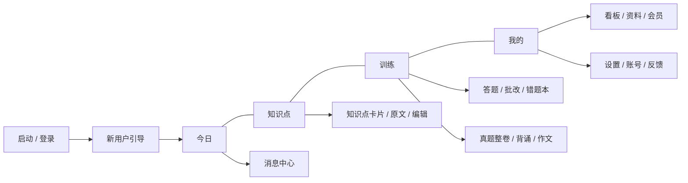
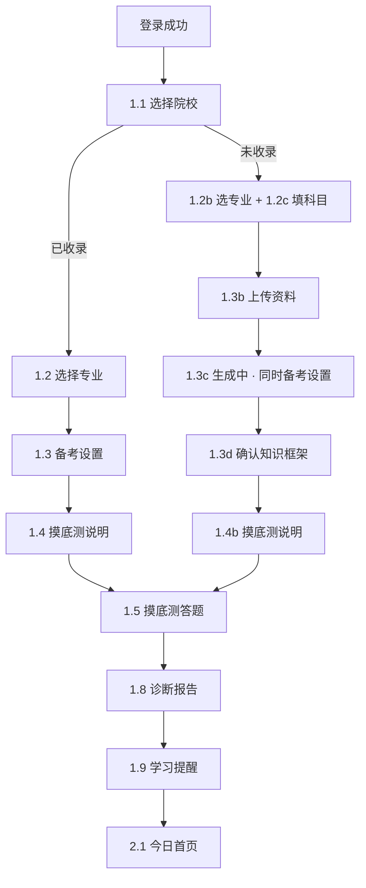
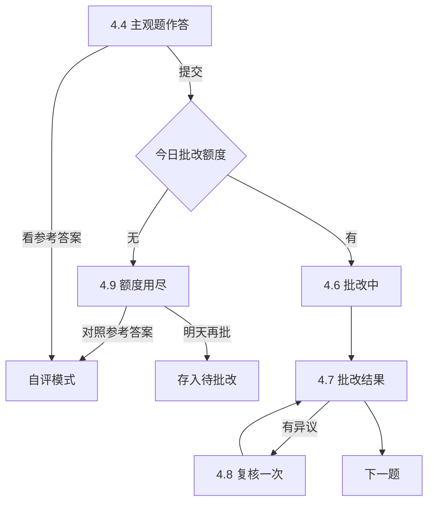
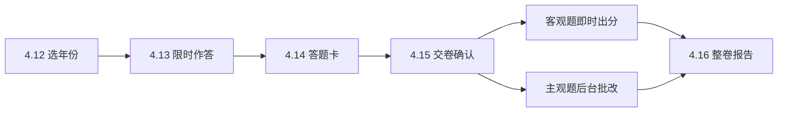
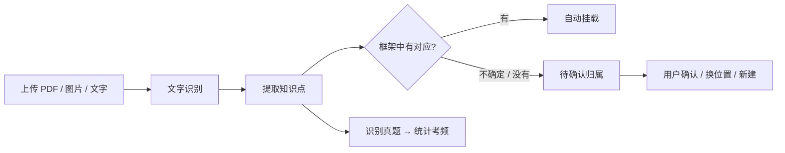

# 考研Training 产品需求文档（PRD）v1

Sep 24, 2026 · @Z

## 1. 文档说明

本文档定义考研Training首期（内测版 v0.1）的全部功能、规则与验收口径，是设计稿之后技术规格与施工文档的依据。页面、交互细节以视觉稿画布为准，文档与画布冲突时以本文档的业务规则为准。

- 视觉稿画布：[考研Training APP 视觉稿 v2](https://claude.ai/artifact/URoTFxjLpB4NnenFA3VARC)，含设计规范板与 79 个页面，每页下方便签为该页交互说明
- 页面编号：本文 `1.3b`、`4.7` 等编号与画布画板标题一致；模块编号 0–6 与画布分页一致
- 示例数据：画布中的分数、题量、年份、价格均为示意，真实值以后台配置和运营提供的内容为准

### 术语表

| 术语 | 含义 |
| --- | --- |
| 预设路径 | 用户院校专业已被平台收录，直接加载平台预设的知识框架包 |
| 自建路径 | 院校专业未收录，用户上传资料，由 AI 生成专属知识库 |
| 知识框架包 | 以院校+专业为单位的预设内容：科目结构、知识点骨架、原文表述、采分点、真题与考频 |
| 知识点 | 最小学习单元，含名称、原文表述、采分点、AI 解读、真题出现记录、掌握度 |
| 采分点 | 答题时得分的关键表述，是主观题批改与挖空背诵的依据 |
| 掌握度 | 0–100 分，由自评、作答表现与遗忘衰减共同计算，映射为四种状态 |
| 挂载 | 把用户资料中识别出的内容关联到知识框架中的某个知识点或章节 |
| 知识问答类 / 写作类 | 专业课科目类型，决定使用刷题背诵体系还是作文训练体系 |
| 今日训练 | 系统每天生成的训练任务：到期复习 + 薄弱查漏 + 背诵 |

## 2. 产品概述

考研Training帮考研学生把专业课资料变成可练、可测、可追踪的知识体系。首期只做考研专业课，优先文科，试点海南大学中国语言文学专业。

### 2.1 目标用户

| 用户 | 典型情况 | 核心诉求 |
| --- | --- | --- |
| 冲刺期考生（首批） | 参加今年 12 月初试，已有资料和框架 | 查漏、背诵、主观题批改 |
| 基础期考生 | 备考明年初试，从零搭建体系 | 资料整理、完整学习闭环 |
| 跨考生 | 专业课零基础，资料最散 | 知识框架、学长资料结构化 |
| 未收录院校考生 | 自命题，市面无题库 | 上传自己的资料也能用全部功能 |

### 2.2 核心价值

1. 忠于原文的知识点：以指定参考书和用户资料的规范表述为主，AI 概括为辅，可追溯原文
2. 真实的掌握度：自评只是弱信号，以作答表现和遗忘规律判断是否真正掌握，并提示「以为会了」
3. 采分点批改：主观题按采分点逐条给出命中、部分命中、遗漏；作文按五个维度打分
4. 每天该练什么：按到期复习、薄弱查漏、背诵自动生成今日训练

### 2.3 首期试点

- 预设内容：海南大学 · 中国语言文学（学术学位），初试专业课 654 语言文学基础、908 作文
- 自建路径：同步开放，建议内测期只邀请少量其他院校用户，验证 AI 建库质量后再推广
- 种子用户：运营同学所在的海大文学专业考生社群

## 3. 首期范围

首期一次性开发全部 7 个模块，按功能开关分批开放给种子用户。原生 App（iOS + 安卓一套代码），内测用安装包分发。

### 3.1 做什么

| 模块 | 首期包含 |
| --- | --- |
| 0 启动与账号 | 启动页、一键登录 / 验证码 / 微信 / Apple 登录、协议、权限说明、版本更新 |
| 1 新用户引导 | 预设路径（3 步）与自建路径（4 步）、摸底测、诊断报告、学习提醒 |
| 2 今日 | 首页五种状态、今日训练完成页、消息中心 |
| 3 知识点 | 知识点树、搜索、知识点卡片、编辑 / 合并 / 拆分、原文查看、908 作文知识库 |
| 4 训练 | 练习设置、客观题、主观题（打字 / 语音 / 拍照）、AI 批改、异议、总结、错题本、真题整卷、背诵三模式 |
| 5 作文 | 题目、写作、拍照上传、素材库、批改、作文本、范文 |
| 6 我的 | 掌握度看板、资料管理、会员、兑换码、邀请、备考设置、设置、账号安全、注销、反馈 |

### 3.2 不做什么

- 公共课（政治、英语、数学）：选专业时明确标注「暂不支持」
- 考研以外的考试（国考、教资、期末考）：数据模型预留考试类型，首期不开放
- 理科计算题与分步判分：内容格式预留 LaTeX，首期不做
- 资料共享、题库社区：上传资料默认且仅本人可见
- 深色模式、自动续费、作文左右对照视图

### 3.3 发布方式

| 平台 | 内测分发 | 支付 |
| --- | --- | --- |
| 安卓 | APK 安装包 | 内测期兑换码；正式版微信 / 支付宝 |
| iOS | TestFlight | 内测期兑换码；正式版 App 内购买 |

## 4. 信息架构与页面清单

底部导航 4 个 Tab：今日、知识点、训练、我的。掌握度看板不单独占 Tab，作为「我的」页卡片进入二级页。全部 79 个页面如下，编号与画布一致。

引导完成后进入四个 Tab；训练、作文等深层页面均为全屏二级页，不显示底部导航。

| 编号 | 页面 | 类型 |
| --- | --- | --- |
| 0.1 | 启动页 | 页面 |
| 0.2 / 0.2b | 一键登录 / 手机号登录 | 页面 |
| 0.3 / 0.3b | 输入验证码 / 验证码错误态 | 页面 · 状态 |
| 0.4 | 用户协议与隐私政策 | 页面 |
| 0.5 / 0.6 | 权限说明 / 版本更新 | 弹窗 |
| 1.1 | 选择院校（分流预设 / 自建） | 页面 |
| 1.2 / 1.3 / 1.4 | 选择专业 / 备考设置 / 摸底测说明（预设路径） | 页面 |
| 1.2b / 1.2c | 选择专业 · 未收录 / 填写专业课科目 | 页面 |
| 1.3b / 1.3c / 1.3d | 上传资料 / 知识库生成中 / 确认知识框架 | 页面 |
| 1.4b | 摸底测说明 · 自建 | 页面 |
| 1.5 / 1.6 / 1.7 / 1.8 | 摸底测答题 / 退出确认 / 报告生成中 / 诊断报告 | 页面 · 弹窗 · 状态 |
| 1.9 | 学习提醒设置 | 页面 |
| 2.1 – 2.1e | 今日首页：正常 / 未摸底 / 今日已完成 / 知识库生成中 / 未上传资料 | Tab · 5 种状态 |
| 2.2 / 2.3 | 今日训练完成 / 消息中心 | 页面 |
| 3.1 / 3.2 | 知识点树 / 搜索 | Tab · 页面 |
| 3.3 / 3.3b | 知识点卡片 / 更多操作 | 页面 · 弹层 |
| 3.4 / 3.5 / 3.6 | 编辑知识点 / 原文查看 / 908 作文知识库 | 页面 |
| 4.1 / 4.2 | 训练首页 / 练习设置 | Tab · 页面 |
| 4.3 / 4.4 / 4.5 | 客观题 / 主观题 / 拍照识别确认 | 页面 |
| 4.6 / 4.7 / 4.8 / 4.9 | 批改中 / 批改结果 / 批改异议 / 额度用尽 | 状态 · 页面 · 弹层 |
| 4.10 / 4.11 | 本组训练总结 / 错题本 | 页面 |
| 4.12 – 4.16 | 真题列表 / 整卷答题 / 答题卡 / 交卷确认 / 整卷报告 | 页面 · 弹层 · 弹窗 |
| 4.17 – 4.20 | 背诵：挖空 / 默写 / 口述 / 完成 | 页面 |
| 4.21 | 退出训练确认 | 弹窗 |
| 5.1 / 5.2 / 5.2b / 5.2c | 作文题目 / 写作 / 拍照上传 / 批改中 | 页面 · 状态 |
| 5.3 / 5.4 / 5.5 / 5.6 | 素材库 / 批改结果 / 作文本 / 范文详情 | 弹层 · 页面 |
| 6.1 / 6.2 | 我的 / 掌握度看板 | Tab · 页面 |
| 6.3 / 6.4 | 我的资料 / 资料解析详情 | 页面 |
| 6.5 / 6.6 / 6.7 / 6.8 | 会员中心 / 支付结果 / 兑换码 / 邀请研友 | 页面 |
| 6.9 – 6.13 | 备考设置 / 设置 / 账号与安全 / 注销账号 / 意见反馈 | 页面 |

## 5. 核心用户流程

### 5.1 新用户引导：两条路径

两条路径在摸底测答题汇合。先登录再引导；引导中途退出 App，下次启动回到中断的步骤。

| 分支 | 触发 | 去向 |
| --- | --- | --- |
| 跳过摸底测 | 1.4 / 1.4b 点「稍后再测」 | 1.9 → 首页「未完成摸底」状态（2.1b） |
| 中途退出摸底 | 1.6 点「退出」 | 首页 2.1b，显示已答进度；已答不足 5 题不生成报告；已答 ≥ 5 题可生成报告，但首页保持 2.1b 直到 20 题答完 |
| 跳过上传 | 1.3b 点「先跳过」 | 首页「未上传资料」状态（2.1e） |
| 生成中先进入 App | 1.3c 点「先进入 App」 | 首页「知识库生成中」状态（2.1d），完成后推送 |

### 5.2 今日训练闭环

每天 0 点按掌握度与遗忘规律生成计划；每道题提交后立即更新掌握度，影响次日计划。

### 5.3 主观题作答与批改

作答方式三选一：打字、语音转文字、拍手写稿（4.5 识别确认后提交）。未满分自动进入错题本。

### 5.4 真题整卷模拟

整卷模式不逐题判分、不显示解析；同一时间只能有一套进行中的试卷。

### 5.5 资料上传与建库

预设用户上传的资料挂到预设框架；自建用户由资料生成框架，首次需在 1.3d 确认。解析在后台进行，完成后推送。

## 6. 功能需求详述

按模块逐页列出功能点、规则和状态。优先级：P0 = 首期必须，P1 = 首期开发、可分批开放。

### 模块 0 · 启动与账号

| 页面 | 功能点与规则 | 优先级 |
| --- | --- | --- |
| 0.1 启动页 | 约 1.5 秒；已登录且完成引导 → 今日首页；已登录未完成引导 → 回到中断步骤；未登录 → 登录页；有强制更新 → 0.6 | P0 |
| 0.2 一键登录 | 运营商本机号码一键登录；协议默认不勾选，未勾选点登录时协议行高亮 + Toast；一键登录失败或无 SIM 卡自动切到 0.2b；微信、Apple 登录首次需绑定手机号 | P0 |
| 0.2b 手机号登录 | 输入满 11 位且格式正确前「获取验证码」禁用；同号 60 秒内只能获取一次，单日上限 10 次 | P0 |
| 0.3 验证码 | 6 位，支持短信自动填充，输满自动提交；倒计时后可重发；「收不到验证码」弹层含语音验证码 | P0 |
| 0.3b 错误态 | 错误时输入框变红抖动并清空；连续错误 5 次验证码失效；5 分钟过期 | P0 |
| 0.4 协议 | 用户协议 / 隐私政策两个 Tab，后台可配置正文；协议更新后老用户下次启动需重新同意 | P0 |
| 0.5 权限说明 | 相机、麦克风、通知、相册：仅在首次使用对应功能时弹出，先说明用途再调系统弹窗；拒绝后在对应功能处引导去系统设置 | P0 |
| 0.6 版本更新 | 启动检查；普通更新每版本提示一次；强制更新不可关闭；内测期安卓下载安装包、iOS 跳 TestFlight | P0 |

登录成功后：新用户进入 1.1；老用户进入 2.1。账号体系以手机号为主键，第三方账号绑定到手机号。

### 模块 1 · 新用户引导

| 页面 | 功能点与规则 | 优先级 |
| --- | --- | --- |
| 1.1 选择院校 | 全国院校可搜索；已收录院校置顶并标「已收录」，其余标「上传资料使用」；选已收录 → 1.2，选未收录 → 1.2b；未选中时「下一步」禁用；搜不到可手动填写院校名 | P0 |
| 1.2 选择专业（预设） | 仅列已收录专业，唯一时默认选中；展示全部初试科目，专业课标「已收录框架与真题」，公共课标「暂不支持」 | P0 |
| 1.3 备考设置 | 备考阶段：9–12 月默认冲刺期，其余默认基础期；初试日期默认取后台按年份配置的具体日期（未公布前界面显示「12 月下旬」，日期默认 12 月 20 日），官方公布后后台统一更新，用户手动改后不再覆盖；每日时长 30 / 45 / 60 / 90 分钟，默认 45 | P0 |
| 1.4 摸底测说明 | 20 道单选、覆盖 654 五个板块各 4 题，按海大考频从预设题库抽取；可「稍后再测」；不消耗 AI 额度 | P0 |
| 1.5 摸底测答题 | 固定最后一项「不确定」（计未掌握、不算答错）；选中后点「下一题」才前进，可返回上一题；不显示对错 | P0 |
| 1.6 退出确认 | 主按钮「继续答题」；退出保存进度 | P0 |
| 1.7 报告生成中 | 三步依次打勾；超 15 秒文案变化；失败可重试，作答已保存 | P0 |
| 1.8 诊断报告 | 各板块预估掌握度 = 该板块摸底正确率（「不确定」计为未答对），低于 40% 标「短板」；标题与冲刺计划由 AI 生成；908 作文卡片 → 5.1 | P0 |
| 1.9 学习提醒 | 提醒时间 07:30 / 12:30 / 20:00 / 自定义；三个通知开关默认开；「开启提醒」触发通知权限说明 → 系统权限 | P0 |
| 1.2b 选择专业（未收录） | 专业来自全国招生目录数据，找不到可手动填写；提示下一步需填科目并上传资料 | P0 |
| 1.2c 填写专业课科目 | 1–4 门；名称必填、代码选填；每门选「知识问答类 / 写作类」；可拍招生目录由 AI 识别后自动填入 | P0 |
| 1.3b 上传资料 | 按科目分别上传：历年真题（推荐）、笔记讲义、参考书目录；至少 1 份可开始；首次建库赠送 200 页；写作类科目可不传；可跳过 | P0 |
| 1.3c 知识库生成中 | 展示进度与四个步骤；同页完成备考阶段与时长设置；可先进入 App，完成后推送；无法识别的文件单独提示替换 | P0 |
| 1.3d 确认知识框架 | 展示板块、知识点数、真题数；板块可重命名、合并、删除；提示缺失资料的影响；「重新生成」保留用户手动修改 | P0 |
| 1.4b 摸底测说明（自建） | 每板块抽 2–3 个知识点由 AI 生成 10 道单选；答题页增加「报错」，报错题不计分；「未分类」不参与；有多门知识问答类科目时摸底第一门 | P0 |

院校、专业、科目数据：后台维护「全国院校专业目录」与「已收录知识框架包」两张表；同一院校专业被收录后，通知已用自建路径的用户一键加载预设内容并与自己资料合并：后续版本再做，首期不做（见 13.2）。

### 模块 2 · 今日

首页按用户状态五选一，优先级从上到下判断：

| 状态 | 判定条件 | 主卡片 | 其他模块 |
| --- | --- | --- | --- |
| 2.1e 未上传资料 | 自建用户且无任何资料 | 去上传资料 | 快捷入口置灰 |
| 2.1d 知识库生成中 | 自建用户资料解析未完成或框架未确认 | 生成进度 / 去确认框架 | 快捷入口置灰，提示补充资料 |
| 2.1b 未完成摸底 | 摸底测未完成 | 继续摸底测 + 已答进度 | 可自由练习；隐藏「以为会了」与掌握度条 |
| 2.1c 今日已完成 | 今日三项计划全部完成 | 已完成 + 连续天数 + 再练一组 | 正常显示 |
| 2.1 正常 | 其余 | 今日训练 + 开始训练 | 正常显示 |

| 页面 | 功能点与规则 | 优先级 |
| --- | --- | --- |
| 2.1 今日首页 | 倒计时按初试日期计算，每日 0 点刷新；今日训练三项数字与预计时长（基础期的「新知识点」并入「薄弱查漏」数字展示）；「以为会了」卡片为 0 时隐藏；快捷入口：背诵、作文、真题、错题本；掌握度条 → 看板；铃铛红点 = 未读消息；下拉刷新 | P0 |
| 2.2 今日训练完成 | 三项完成后自动弹出；完成题数、正确率、用时；掌握度变化前 3 条；本周打卡周历与连续天数，中断不做惩罚提示 | P0 |
| 2.3 消息中心 | 三类：学习提醒、处理结果（资料解析、作文批改、整卷批改）、系统通知；点击跳转并标已读；保留 30 天；支持全部已读 | P1 |

### 模块 3 · 知识点

| 页面 | 功能点与规则 | 优先级 |
| --- | --- | --- |
| 3.1 知识点树 | 科目切换（知识问答类科目显示树，写作类显示 3.6）；层级：板块 → 章节 → 知识点，板块默认折叠，记住上次展开；筛选：全部 / 未掌握 / 高频考点（真题 ≥ 2 次）/ 来自我的资料；每个知识点显示掌握状态与真题次数；右上角上传资料 | P0 |
| 3.2 搜索 | 未输入时显示最近搜索与高频考点；输入即搜（300ms 防抖）；结果分知识点 / 真题 / 我的资料原文三组，每组最多 3 条可展开；匹配文字高亮；无结果引导上传资料 | P0 |
| 3.3 知识点卡片 | 原文表述（采分关键词下划线）+ 出处；采分点列表；AI 解读（首次打开生成并缓存）；真题标签点击直接作答；三档自评（选「掌握」时提示需答题验证）；「来一题检验」出该知识点题目；左右滑动切换同章节知识点 | P0 |
| 3.3b 更多操作 | 编辑内容 / 调整归属 / 合并 / 拆分 / 内容有误反馈 | P0 |
| 3.4 编辑知识点 | 可改名称、原文表述、采分点（增删改、拖动排序）、归属；修改只影响用户自己的库；被改的预设知识点标「已自定义」，可一键恢复；未保存离开需确认；保存后 AI 解读重新生成，已有题目（含真题）仍按原采分点批改，挖空与之后新出的题按新采分点；合并时目标 M 取两者较高值、作答与错题记录合并，拆分时新知识点继承原 M 与复习状态 | P1 |
| 3.5 原文查看 | 定位到资料原页并高亮段落，标签显示知识点名；支持缩放、翻页；显示本页关联的其他知识点；预设内容显示「参考书名 · 页码」文字 | P0 |
| 3.6 908 作文知识库 | 写作方法（按要点，掌握度来自作文对应维度得分）、素材库（按主题，可收藏）、高分范文入口 | P1 |

内容有误反馈：错误类型（原文错误 / 采分点不对 / AI 解读有误）+ 说明，进入运营审核队列；预设内容由运营修订后全量生效。

### 模块 4 · 训练

| 页面 | 功能点与规则 | 优先级 |
| --- | --- | --- |
| 4.1 训练首页 | 今日推荐（与首页同一任务）；按题型快速进入练习设置；专项入口：真题整卷、背诵、作文、错题本 | P0 |
| 4.2 练习设置 | 范围（板块多选，可按章节细选）、题型多选、题量 10 / 20 / 30、只练未掌握、优先使用真题；至少 1 个板块和 1 种题型；设置记忆；显示预计用时 | P0 |
| 4.3 客观题 | 单选 / 判断；选中即判分，正确项绿、错选红，展开解析与知识点入口；「不会，看答案」计未掌握；每组客观题在前、主观题在后 | P0 |
| 4.4 主观题 | 名词解释 / 简答 / 论述；打字、语音转文字、拍手写稿；每 5 秒自动存草稿；字数建议按题型（80–150 / 200–400 / 600+）；显示剩余批改次数；「看参考答案」不耗额度、计未掌握 | P0 |
| 4.5 拍照识别确认 | 支持多张续拍、相册选取；低置信度字词琥珀色标出需核对；模糊时提示重拍；确认后的文字为最终答案 | P0 |
| 4.6 批改中 | 三步依次打勾，底部轮播答题技巧；超 15 秒文案变化，超 40 秒可先做下一题、完成后通知；失败不扣次数 | P0 |
| 4.7 批改结果 | 得分 + 命中数；逐条采分点：命中（绿）/ 部分命中（琥珀）/ 遗漏（红）并引用用户原话；参考答案可展开；掌握度变化；未满分自动进错题本；从「看参考答案」进入时不显示得分 | P0 |
| 4.8 批改异议 | 四类原因单选 + 选填说明；提交后免费复核一次，结果页标「已复核」；以复核结果为准，掌握度按两次得分差回算，错题本同步；复核结果页提供「仍有异议」，进入人工审核 | P0 |
| 4.9 额度用尽 | 触发点：主观题批改、作文批改、整卷批改、AI 出题、资料上传；出路：开通会员 / 对照参考答案 / 明天再批改（存入待批改，次日提醒；作文、整卷为每周额度，改为「下周再批改」） | P0 |
| 4.10 本组总结 | 题数、正确率、用时；按题型得分率；失分最多 3 个知识点；今日计划完成时「完成」进 2.2 | P0 |
| 4.11 错题本 | 收录：客观题错、主观题未满分、看答案的题；默认按知识点分组，可按题型 / 板块 / 时间；不同日期连续答对 2 次自动移出计入「已消灭」，也可左滑移出；「重做全部」按遗忘优先级 | P0 |
| 4.12 真题列表 | 按年份倒序，状态：进行中 / 已完成（得分）/ 未开始；同时只能一套进行中；可重做保留历次得分 | P1 |
| 4.13 整卷答题 | 180 分钟倒计时，剩 15 分钟变红提醒，到时自动交卷；不判分不显示解析；可标记题目；离开答题页或 App 切到后台时计时暂停，设置中可改为严格模式（均不暂停） | P1 |
| 4.14 答题卡 | 已答 / 未答 / 标记 / 当前四种状态；点题号跳转；交卷入口在此 | P1 |
| 4.15 交卷确认 | 显示未答与标记数量；交卷后客观题即时出分，主观题后台批改，可离开 | P1 |
| 4.16 整卷报告 | 预估总分并标注「仅供参考」；题型得分率；失分最多知识点；逐题查看；针对失分练一组 | P1 |
| 4.17 挖空 | 挖空位置 = 采分关键词，点击逐个揭开或全部显示；三档自评 | P0 |
| 4.18 默写 | 打字或拍照；只比对采分关键词覆盖，措辞差异不扣分；全覆盖记「记住了」，过半记「模糊」 | P1 |
| 4.19 口述 | 录音最长 2 分钟，实时转文字；结束后显示要点覆盖；嘈杂时建议改用默写 | P1 |
| 4.20 背诵完成 | 三档统计；下次复习安排；「再背没记住的」 | P0 |
| 4.21 退出训练确认 | 主按钮「继续训练」；保存进度与草稿；首页显示断点进度 | P0 |

### 模块 5 · 作文

仅对「写作类」科目开放（预设：海大 908 作文；自建：用户标记为写作类的科目）。自建写作类科目沿用五个维度，满分后台可配置；没有预设内容时隐藏写作方法与范文。

| 页面 | 功能点与规则 | 优先级 |
| --- | --- | --- |
| 5.1 作文题目 | 三个来源：真题题目（后台导入 / 用户上传）、AI 命题（按该校近年风格）、自拟题目；本周目标（默认 2 篇）进度与平均分；已写题目显示最高分 | P0 |
| 5.2 写作 | App 内打字；可选限时 60 分钟（默认开）；实时字数；草稿自动保存；字数不足提交时二次确认；调出素材库；提交进入 5.2c | P0 |
| 5.2b 拍照上传手写稿 | 多页拍摄、拖动排序、单页重拍；识别不确定字词标出供修改；原图保存可回看 | P0 |
| 5.2c 作文批改中 | 约 30 秒；可离开，完成后推送并进消息中心；失败不扣次数 | P0 |
| 5.3 素材库 | 写作中底部弹层；默认显示与题目相关的主题；「插入」以灰色提示形式插入要点；只提供素材概述与用法，不提供可直接抄写的成段文字 | P1 |
| 5.4 作文批改结果 | 总分 150，五维度各 30：立意、结构、内容与论证、语言表达、文采与亮点；总评（亮点 / 问题 / 建议各一条）、逐段批注、范文对比三个视图；支持异议；「按建议重写」带原文进入写作页 | P0 |
| 5.5 作文本 | 全部作文倒序，同题多稿标第几稿；最近 5 篇分数趋势；最弱维度链接到写作方法；左滑删除 | P1 |
| 5.6 范文详情 | 结构导航；关键句下划线 + 写法批注；范文须平台原创或已授权 | P1 |

作文维度得分同步更新 3.6「写作方法」对应要点的掌握度。

### 模块 6 · 我的

| 页面 | 功能点与规则 | 优先级 |
| --- | --- | --- |
| 6.1 我的 | 头像区 → 备考设置；齿轮 → 设置；会员条（免费版显示开通，会员显示到期日，到期前 7 天提醒）；掌握度看板卡片；免费额度（会员隐藏）；我的资料、错题本、作文本、邀请研友 | P0 |
| 6.2 掌握度看板 | 总体分布与四种状态数量；各板块掌握度与本周变化；写作类科目显示五维平均分；自评与实测偏差列表（最多 3 条，可展开）并一键加入今日训练 | P0 |
| 6.3 我的资料 | 上传 PDF / 拍照（≤ 20 张）/ 粘贴文字，单个 PDF ≤ 100 页；解析进度；待确认数标签；已用额度；左滑删除（同时删除仅来自该资料的知识点，需确认）；仅本人可见 | P0 |
| 6.4 资料解析详情 | 识别 / 挂载 / 待确认数量；待确认三种处理：按建议确认 / 换位置 / 不需要；可一键全部按建议确认；已挂载列表；原文查看 | P0 |
| 6.5 会员中心 | 权益对比表；三档：冲刺卡、考季卡（默认选中）、月卡；按钮随档位显示价格；一次性购买不自动续费；兑换码入口；会员协议 | P0 |
| 6.6 支付结果 | 成功显示档位与到期日；失败 / 取消可重新支付；处理中轮询最长 10 秒 | P0 |
| 6.7 兑换码 | 自动转大写去空格；为空禁用；错误时输入框变红提示；错误 5 次锁定 10 分钟；时长叠加到当前会员之后 | P0 |
| 6.8 邀请研友 | 6 位邀请码，复制 / 分享微信 / 生成海报；好友注册并完成摸底测后双方各得 7 天会员（直接发放，不走兑换码）；单人上限 70 天；海报含邀请码与 App 下载二维码；邀请记录 | P1 |
| 6.9 备考设置 | 院校与专业（更换走 1.1 流程并二次确认，切换知识框架、保留学习记录）；初试日期；备考阶段；每日时长；每周作文目标；学习提醒；重新做摸底测（报告与上次对比）；修改次日生效 | P0 |
| 6.10 设置 | 账号与安全；通知开关（系统权限关闭时提示去设置）；清除缓存；意见反馈；协议；关于（版本、检查更新、iOS 恢复购买）；退出登录需确认 | P0 |
| 6.11 账号与安全 | 更换手机号（验证旧号 + 新号）；微信 / Apple 绑定与解绑（至少保留一种）；登录设备管理；注销入口 | P0 |
| 6.12 注销账号 | 列明删除范围；勾选确认后可点，再做一次短信验证；7 天冷静期内登录可撤销；期满删除全部个人数据；注销后该手机号 30 天内不可再注册（仅保存手机号哈希 30 天，写入隐私政策）；未到期会员作废不退款 | P0 |
| 6.13 意见反馈 | 类型：功能建议 / 内容有误 / 批改不准 / 出现问题；描述 ≥ 5 字；截图 ≤ 3 张；自动附带版本与设备；从批改页、知识点页进入时带上对应 ID；回复走消息中心 | P1 |

## 7. 核心业务规则

首版全部用可解释的规则实现，参数放后台配置，内测后按数据调参；不引入黑盒模型。

### 7.1 掌握度分数

每个知识点一个 0–100 的掌握分 M。自评只设初始值且有上限，之后由作答事件增减，并随逾期衰减。

| 事件 | M 的变化 |
| --- | --- |
| 自评（仅在从未作答时生效，可多次，以最近一次为准） | 不会 = 0，模糊 = 30，掌握 = 50（自评最高只能到 50）；已有作答记录后自评只记录、不改 M |
| 客观题答对 | 易 +10 / 中 +15 / 难 +20 |
| 客观题答错 | −15 |
| 主观题批改 | +25 × 得分率 − 10（满分 +15，零分 −10） |
| 点「看答案 / 看参考答案」 | −10 |
| 背诵自评 | 记住了 +8，模糊 +2，没记住 −8 |
| 逾期未复习 | 超过下次复习日后每天 −3 |

结果截断在 0–100。摸底测不写入知识点 M，板块预估分只用于今日计划（见 7.4）。

- 一道题关联多个知识点时，按题目与知识点的关联对每个知识点分别应用同一事件
- 背诵只改 M 与背诵复习日，不计入「答对」，也不算作答验证
- 自评不安排复习

### 7.2 掌握状态

| 状态 | 判定 |
| --- | --- |
| 未学习 | 没有任何浏览、自评或作答记录 |
| 学习中 | 有浏览、自评或背诵记录，但从未作答验证 |
| 待巩固 | 有作答记录，但未达到「已掌握」条件 |
| 已掌握 | M ≥ 80，且近 30 天内在 2 个不同日期答对过（主观题得分率 ≥ 80% 视为答对；背诵不计入） |

「以为会了」：最近一次自评为「掌握」，且近 7 天该知识点作答 ≥ 2 次、正确率 < 50%。首页与看板提示数量。

板块掌握度 = 板块内知识点 M 的平均值；写作方法要点的 M 取作文对应维度最近 3 次得分率的平均 × 100。

### 7.3 复习间隔

| 本次结果 | 下次复习 |
| --- | --- |
| 答错 / 没记住 / 点「看答案」/ 主观题得分率 < 50% | 1 天后，间隔序列重置 |
| 模糊 / 主观题得分率 50–79% | 2 天后，序列不前进 |
| 答对 / 记住了 / 主观题得分率 ≥ 80% | 按序列前进：3 → 7 → 15 → 30 天（首次答对为 3 天） |

作答结果安排知识点的复习日；背诵自评按同一张表单独安排背诵复习日，两者互不影响。

### 7.4 今日计划生成

每天 0 点为每个用户生成，按「每日学习时长」分配预算，单题预计用时：客观题 1 分钟、名词解释 3 分钟、简答 6 分钟、背诵 1 分钟 / 条。

| 组成 | 冲刺期 | 基础期 | 选取规则 |
| --- | --- | --- | --- |
| 到期复习 | 35% | 30% | 下次复习日 ≤ 今天，按逾期天数、考频排序 |
| 薄弱查漏 | 45% | 30% | 按 考频权重 × (100 − M) 从高到低，排除今日已在复习中的；未学习的知识点以所在板块的摸底预估分作为 M 参与排序（未做摸底时按 0） |
| 背诵 | 20% | 20% | 背诵队列中背诵复习日 ≤ 今天的条目，采分关键词挖空 |
| 新知识点 | 0 | 20% | 按章节顺序推进未学习知识点 |

背诵队列：有过自评或作答、且有采分关键词的知识点自动进入，进入当天即到期，之后按 7.3 安排背诵复习日。首页只展示三项：基础期的新知识点并入「薄弱查漏」数字，「今日三项全部完成」包含新知识点。

考频权重 = 1 + 近 6 年真题出现次数 × 0.5；自建用户无真题时统一为 1。题目优先使用真题，不足时由 AI 生成变式题；一组题内客观题在前、主观题在后。

### 7.5 错题本

- 收录：客观题答错、主观题得分率 < 100%、点「看答案」的题
- 移出：同一题在 2 个不同日期连续答对（主观题得分率 ≥ 80% 视为答对）自动移出，计入「已消灭」；用户也可手动移出
- 「重做全部」按下次复习日升序出题

## 8. AI 能力需求

核心原则：忠于原文优先于 AI 发挥。知识点表述、采分点、批改依据都必须能追溯到预设内容或用户资料，AI 只做提取、组织、比对和解释。所有模型调用走服务端统一接口层，可按能力切换模型。

### 8.1 能力清单

| 能力 | 输入 | 输出 | 关键要求 | 时延目标 |
| --- | --- | --- | --- | --- |
| 资料解析 | PDF / 图片 / 文字 | 分页文字、版面结构 | 低置信度字词标记；加密、模糊文件单独报错 | 每 10 页 ≤ 30 秒 |
| 知识点提取与挂载 | 资料文字 + 现有框架 | 知识点（名称、原文、采分点、出处页码）+ 挂载位置 + 置信度 | 原文表述必须是资料原句；置信度低于阈值进入待确认 | 后台异步 |
| 框架生成（自建） | 全部资料 + 科目 + 目录（可选） | 板块 → 章节 → 知识点树 | 有目录时按目录；无法归类放「未分类」 | 2–5 分钟 |
| 真题识别 | 真题资料 | 题目、题型、分值、年份、关联知识点 | 用于考频统计与整卷 | 后台异步 |
| AI 解读 | 知识点原文 + 采分点 | 1–3 句通俗解释 | 不得引入原文之外的新论断；生成后缓存 | ≤ 5 秒 |
| 出题 | 知识点 + 题型 + 难度 | 题干、选项 / 参考答案、采分点、解析 | 答案与采分点来自原文；客观题干扰项需合理且唯一正确 | 单题 ≤ 5 秒，可预生成 |
| 主观题批改 | 题目、采分点、参考答案、用户答案 | 每个采分点：命中 / 部分 / 遗漏 + 引用用户原话 + 建议；总分 | 同义表述判「部分命中」并给规范表述；同一答案重复批改分差 ≤ 1 分 | ≤ 8 秒 |
| 作文批改 | 题目、作文全文、评分标准 | 五维度分数、总评三条、逐段批注 | 同一作文重复批改总分差 ≤ 6 分 | ≤ 40 秒 |
| 默写 / 口述比对 | 原文采分关键词 + 用户文本 | 关键词覆盖情况 | 规则优先、AI 补充同义判断；不耗额度 | ≤ 3 秒 |
| 计划与报告文案 | 统计数据 | 标题与计划文案 | 只描述数据，不夸大 | ≤ 5 秒 |

### 8.2 质量兜底

- 预设内容：AI 生成初稿，运营逐条校验后上线
- 自建内容：框架确认页（1.3d）、待确认归属（6.4）、题目「报错」、内容有误反馈
- 批改：异议后以更严格提示词复核一次；复核仍有异议进入人工审核队列
- 所有 AI 生成内容标注来源（预设 / 我的资料 / AI 生成），协议中说明 AI 内容仅供学习参考

### 8.3 评测集

开发前由运营建立，每次改提示词或换模型都必须跑一遍，指标不得下降才能上线。

| 评测集 | 规模 | 评估指标 | 上线门槛 |
| --- | --- | --- | --- |
| 知识点提取 | 100 个知识点的标准原文与采分点 | 原文一致率、采分点召回率 | ≥ 90% / ≥ 85% |
| 主观题批改 | 50 道题 × 3 档水平答案，含运营标注得分 | 与人工评分偏差 ≤ 1 分的比例 | ≥ 80% |
| 作文批改 | 20 篇不同分数档作文，含运营评分 | 与人工总分偏差 ≤ 10 分的比例 | ≥ 75% |
| 出题 | 50 道 AI 生成题人工审核 | 可用率（无错误、答案唯一） | ≥ 90% |

## 9. 商业化

免费版保证完整闭环、限制用量；会员解除限制。首期一次性购买、不自动续费；内测期以兑换码开通为主，用兑换码 + 访谈测试付费意愿。所有数值后台可配置。

### 9.1 权益与额度

| 权益 | 免费版 | 会员 | 重置周期 |
| --- | --- | --- | --- |
| 主观题批改 | 3 次 | 不限 | 每日 0 点 |
| AI 出题 | 20 题 | 不限 | 每日 0 点 |
| 作文批改 | 1 篇 | 不限 | 每周一 0 点 |
| 真题整卷批改 | 1 套 | 不限 | 每周一 0 点 |
| 资料上传 | 50 页（首次建库另赠 200 页） | 1000 页 | 累计，不重置 |
| 摸底测、客观题判分、默写 / 口述比对、自评模式 | 不限 | 不限 | — |

计数规则：批改失败、复核、看参考答案不计次；真题原题不计入 AI 出题；AI 出题只在用户主动触发且为新生成时计数，今日计划后台补题与跨用户复用的缓存题不计；删除资料不返还已用页数；上传页数折算：PDF 按页、1 张照片 = 1 页、粘贴文字每 2000 字 = 1 页（不足按 1 页）；「首次建库赠 200 页」按用户计一次，只给自建路径用户。

### 9.2 会员档位（测试价）

| 档位 | 价格 | 有效期 | 定位 |
| --- | --- | --- | --- |
| 冲刺卡 | ¥59 | 至当年初试结束（按后台配置的初试结束日期；当年初试结束后下架） | 冲刺期考生 |
| 考季卡 | ¥169 | 至次年初试结束（按后台配置的初试结束日期） | 默认推荐 |
| 月卡 | ¥29.9 | 30 天 | 灵活试用 |

### 9.3 兑换码与邀请

- 兑换码：运营后台批量生成，可设档位、时长、有效期、批次；一码一次；时长叠加到当前会员之后
- 邀请：好友注册并完成摸底测后，双方各得 7 天会员；单人累计上限 70 天；奖励以会员天数直接发放

## 10. 通用状态与异常处理

每个页面上线前都要覆盖以下状态，样式统一取自设计规范板的「反馈与状态」部分。

| 状态 | 表现 | 规则 |
| --- | --- | --- |
| 加载中 | 骨架屏 | 超过 300ms 才显示，避免闪烁 |
| AI 生成中 | 三色圆点 + 分步打勾 + 预计时长 | 超 15 秒换安抚文案；可离开的任务完成后推送 |
| 空状态 | 图标 + 一句说明 + 一个行动按钮 | 文案说明「为什么空」和「怎么有」 |
| 网络错误 | 图标 + 说明 + 重试 | 作答内容先存本地，恢复后自动提交 |
| AI 失败 | 「生成失败，未扣除次数」+ 重试 | 同一任务自动重试 1 次后再提示用户 |
| 额度不足 | 底部弹层（4.9） | 永远给免费出路，不堵死流程 |
| 操作反馈 | Toast，2 秒消失 | 加入错题本、已保存、已复制等 |
| 危险操作 | 确认弹窗 | 退出训练、交卷、删除资料、退出登录、注销 |

数据安全：主观题、作文、整卷的作答内容每 5 秒本地存草稿；App 被杀或崩溃后重新进入时恢复。

## 11. 数据指标与埋点

北极星指标：每周掌握度提升的知识点数（周内 M 净增 ≥ 10 的知识点数量，按活跃用户平均）。

### 11.1 内测期目标

| 指标 | 定义 | 目标 |
| --- | --- | --- |
| 首日激活率 | 注册当日完成摸底测并看到报告 | ≥ 60% |
| 自建建库完成率 | 自建用户注册 3 天内完成框架确认 | ≥ 50% |
| 次日 / 7 日留存 | 完成引导的用户次日、第 7 日打开 | ≥ 50% / ≥ 30% |
| 今日训练完成率 | 活跃日中完成今日三项的比例 | ≥ 40% |
| 批改认可率 | 批改结果未被提异议的比例 | ≥ 90% |
| 知识点修改率 | 被用户编辑或报错的知识点占比（预设 / 自建分开统计） | ≤ 5% / ≤ 15% |
| 付费意愿 | 访谈中表示愿付费 + 冲刺卡兑换后续费意向 | 访谈记录 |

### 11.2 关键埋点事件

| 模块 | 事件 |
| --- | --- |
| 账号与引导 | login\_success（方式）、onboarding\_step（步骤、路径：预设 / 自建）、diag\_start、diag\_finish、report\_view |
| 自建建库 | material\_upload（类型、页数）、parse\_finish（耗时、知识点数、待确认数）、framework\_confirm（修改次数）、framework\_regenerate |
| 训练 | plan\_generate、session\_start / session\_finish（来源、题数）、answer\_submit（题型、方式：打字 / 语音 / 拍照、耗时）、reveal\_answer |
| AI 质量 | grade\_result（得分、采分点命中数、耗时）、grade\_dispute（原因）、grade\_recheck（分数变化）、question\_report、knowledge\_edit、knowledge\_report |
| 背诵与作文 | recite\_rate（模式、自评档）、essay\_submit（方式、字数）、essay\_grade（维度分） |
| 商业化 | quota\_block（类型、选择的出路）、member\_page\_view、redeem（结果）、invite\_success |

所有事件带公共字段：用户 ID、路径类型、院校专业、备考阶段、App 版本、平台。

## 12. 非功能需求与合规

### 12.1 性能与体验

- 冷启动到首页可交互 ≤ 2 秒（中端安卓机）；页面切换 ≤ 300ms
- 答题页离线可用：当天计划题目预下载，客观题离线判分，主观题联网后批改
- 适配 iOS（最低版本以当前 Expo SDK 的最低支持版本为准）与 Android 9+；点击区域 ≥ 44 × 44；支持系统字体放大到 1.3 倍不破版

### 12.2 隐私与数据

- 上传资料默认且仅本人可见，不用于其他用户，不用于模型训练（隐私政策写明）
- 资料与作答数据加密存储；传输全程 HTTPS
- AI 调用只在服务端进行，客户端不持有任何模型密钥
- 注销：7 天冷静期后删除全部个人数据；删除资料时同步删除仅由其产生的知识点与题目

### 12.3 上架与合规

- 苹果：提供第三方登录时同时提供 Apple 登录；App 内可注销账号；虚拟会员走 App 内购买
- 国内上架：App 备案、软件著作权；面向国内提供生成式 AI 功能，需按规定完成相应的备案或登记，并选用合规模型，上线前咨询确认
- 内容：预设内容中的知识点概括为原创表述；真题原文由运营确认来源；范文为平台原创或已授权；素材库不提供可直接抄写的成段文字
- 未成年人：考研用户基本为成年人，注册时不单独做年龄验证（如后续扩展到中高考需重新评估）

## 13. 待补充内容与后续版本

### 13.1 开发前需团队提供

- [ ] 海大中国语言文学知识框架包：知识点、原文表述、采分点、历年真题（运营）
- [ ] 历年 908 作文真题题目与授权范文（运营）
- [ ] 评测集三份：知识点、主观题批改、作文批改（运营，见 8.3）
- [ ] 用户协议、隐私政策、会员服务协议正文（法务）
- [ ] 全国院校专业目录数据来源（产品）
- [ ] 生成式 AI 备案与模型选型确认（产品 + 技术）
- [ ] 运营后台（简易版）随首期开发，覆盖后台配置、兑换码、审核与反馈回复（见施工文档 T50）

### 13.2 后续版本

| 方向 | 内容 |
| --- | --- |
| 扩展专业 | 按「参考书层知识点库 + 院校层映射」扩到其他院校中文专业，再扩其他文科专业 |
| 扩展考试 | 大学期末复习、教资、法考等同样「自学资料多」的考试，填补考研淡季 |
| 理科支持 | LaTeX 公式、计算题分步判分 |
| 算法升级 | 掌握度与复习间隔改用知识追踪 / FSRS 类模型 |
| 体验 | 深色模式、作文左右对照、自动续费、学习社群 |
| 自建转预设 | 院校专业被收录后，自建用户一键加载预设内容并与自己资料合并 |
